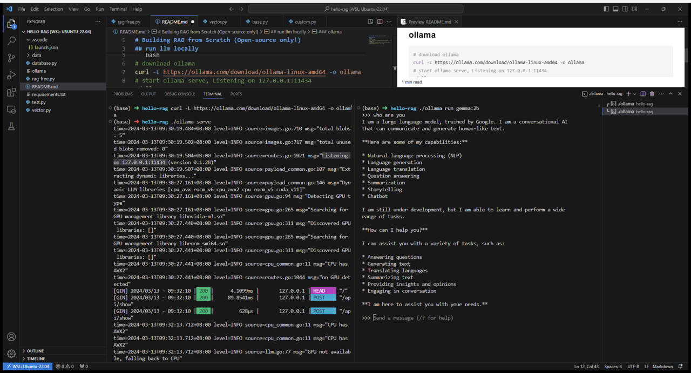
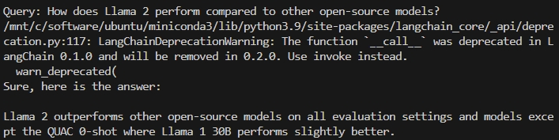
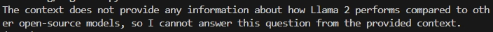
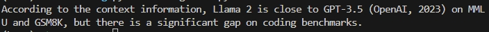

# Building RAG from Scratch (Open-source only: gemma:2b gguf!)

## run llm locally
### ollama
```bash
# download ollama
curl -L https://ollama.com/download/ollama-linux-amd64 -o ollama
# start ollama serve, Listening on 127.0.0.1:11434 
./ollama serve 
# use gemma:2b, pull model weight first, and load to memory
./ollama run gemma:2b
# input question or prompt or special args
```


## download emmbedding model
### BAAI/bge-small-en-v1.5
```python
# use huggingface_hub snapshot_download
#coding:utf-8
import os
os.environ["HF_ENDPOINT"] = "https://hf-mirror.com"
from huggingface_hub import snapshot_download
snapshot_download(repo_id="BAAI/bge-small-en-v1.5", ignore_patterns=[".safetensors"], local_dir="/mnt/d/work/models")
```
if encounter `huggingface_hub.utils._errors.LocalEntryNotFoundError`，it's connect error maybe set `HF_ENDPOINT=https://hf-mirror.com`
Detailed processing reference : https://github.com/Stability-AI/generative-models/issues/215#issuecomment-

## building RAG pipeline
### use langchain
```bash
python -B langchain-rag.py
```

### use llama_index
```bash
python -B rag-free.py
```
may not work

in the package of llama-index-llms-ollama is_chat_model=True，so  it request api/chat of ollama, this not work in my test;
but when i set is_chat_model=False, it will request api/generate，this can work：

so I have been created an issue: https://github.com/run-llama/llama_index/issues/11971#issuecomment-2000392935